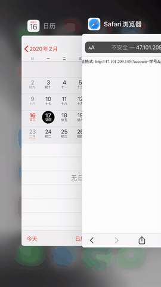

# NJUPT-iCal

Generate iCalendar file (.ics) through [NJUPT-API](https://github.com/gaoliang/NJUPT-API)


## [Demo Server](http://106.53.120.56)

> 已支持2021春期
> 2021-03-08



## 安装 & 运行

```
docker-compose up
```


